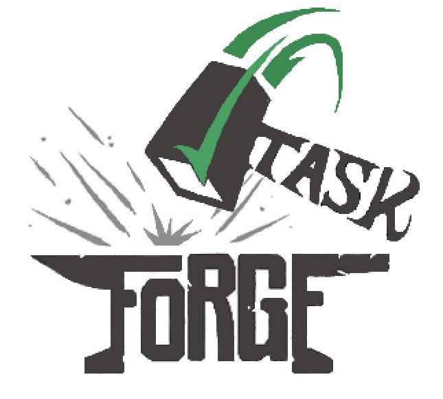
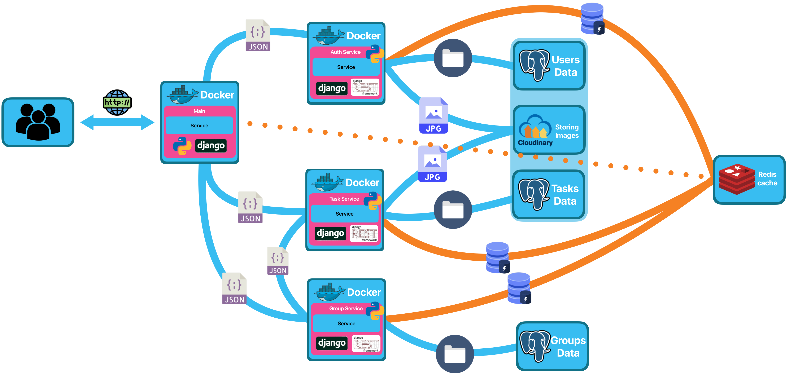

**Task Forge** - a microservice-based application, built with Django REST Framework. It allows users to create groups, create tasks in groups with photos and description, take tasks, finish tasks, delete tasts, track progress. Features include JWT authentication, Redis caching, PostgreSQL for data storage, and Cloudinary for image management.

---
## **Scheme of work**

### Scheme Description:
1. **Users** - send requests to the application. Using: `Redis`(user sessions)
2. **Main service** - accepts requests and accesses other microservices to fulfill user instructions.
3. **Auth service**	- responsible for issuing jwt tokens, registering and logging, and retrieving information about users. Using: `PostgreSQL`(to store user information and links to images), `Cloudinary`(image storage), `Redis`(cache).
4. **Task service** - responsible for all task logic, all tasks are linked to a specific group. Using: `PostgreSQL`(to store tasks information and links to images), `Cloudinary`(image storage), `Redis`(cache).
5. **Group service** - responsible for all group logic (creating, adding users, logging users out of groups, ...). Using: `PostgreSQL`(to store groups information), `Redis`(cache).

---
## **Technology:**
- **Backend**: Django, Django REST Framework (DRF), JWT Authentication  
- **Databases**: PostgreSQL  
- **Caching**: Redis  
- **Image Storage**: Cloudinary  
- **Deployment**: Render, Docker  
- **API integrations**: Cloudinary

---
## Additional information:
**Performance** - The whole application is fully deployed on Render using free plans, but because of this the speed of responses is not the best. Any query to the database takes at least 1 second, so I try to cache everything, but if you run the application locally (with a local database) or with at least the cheapest plan everything will work quite fast. 

---
### **Contacts**
If you have any questions or suggestions, email me:

📧 **Email**: bliznukantonmain@gmail.com
